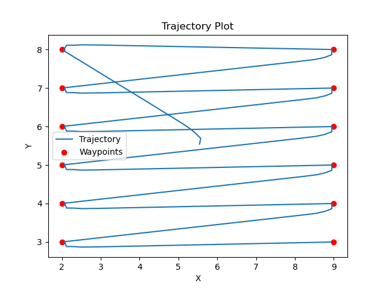
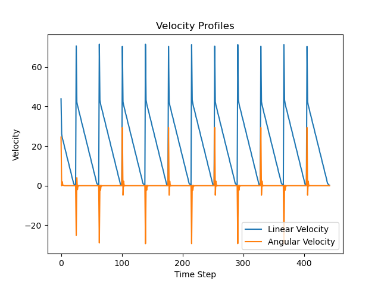
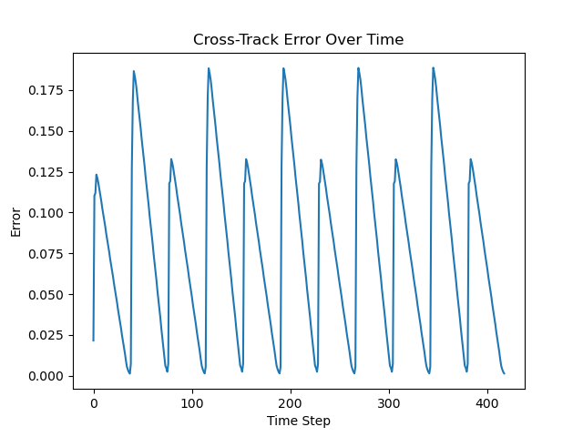
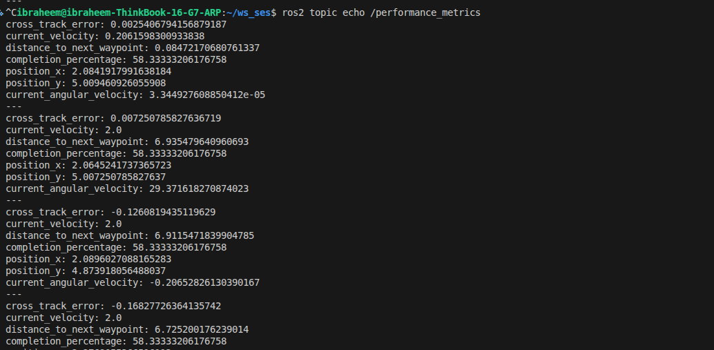

# First-Order Boustrophedon Navigator


In this assignment, you will understand the provided code in ROS2 with Turtlesim, and refactor and/or tune the navigator to implement a precise lawnmower survey (a boustrophedon pattern). The current code will do the first pattern shown above, which is not a uniform lawnmower survey, shown in the second figure. 

Modify the code to meet the requirements for a uniform survey. 

## Background
Boustrophedon patterns (from Greek: "ox-turning", like an ox drawing a plow) are fundamental coverage survey trajectories useful in space exploration and Earth observation. These patterns are useful for:

- **Space Exploration**: Rovers could use boustrophedon patterns to systematically survey areas of interest, ensuring complete coverage when searching for geological samples or mapping terrain. However, due to energy constraints, informative paths are usually optimized, and this results in paths that are sparser than complete coverage sampling, and may still produce high-accuracy reconstructions. 
  
- **Earth Observation**: Aerial vehicles employ these patterns for:
  - Agricultural monitoring and precision farming
  - Search and rescue operations
  - Environmental mapping and monitoring
  - Geological or archaeological surveys
  
- **Ocean Exploration**: Autonomous underwater vehicles (AUVs) use boustrophedon patterns to:
  - Map the ocean floor
  - Search for shipwrecks or aircraft debris
  - Monitor marine ecosystems
  
The efficiency and accuracy of these surveys depend heavily on the robot's ability to follow the prescribed path with minimal deviation (cross-track error). This assignment simulates these real-world challenges in a 2D environment using a first-order dynamical system (the turtlesim robot).

## Objective
Tune a PD controller to make a first-order system execute the most precise boustrophedon pattern possible. The goal is to minimize the cross-track error while maintaining smooth motion.

## Learning Outcomes
- Understanding PD control parameters and their effects on first-order systems
- Practical experience with controller tuning
- Analysis of trajectory tracking performance
- ROS2 visualization and debugging

## Prerequisites

### System Requirements
Choose one of the following combinations:
- Ubuntu 22.04 + ROS2 Humble
- Ubuntu 23.04 + ROS2 Iron
- Ubuntu 23.10 + ROS2 Iron
- Ubuntu 24.04 + ROS2 Jazzy

### Required Packages
```bash
sudo apt install ros-$ROS_DISTRO-turtlesim
sudo apt install ros-$ROS_DISTRO-rqt*
```

### Python Dependencies
```bash
pip3 install numpy matplotlib
```

## The Challenge

### 1. Controller Tuning (60 points)
Use rqt_reconfigure to tune the following PD controller parameters in real-time:
```python
# Controller parameters to tune
self.Kp_linear = 1.0   # Proportional gain for linear velocity
self.Kd_linear = 0.1   # Derivative gain for linear velocity
self.Kp_angular = 1.0  # Proportional gain for angular velocity
self.Kd_angular = 0.1  # Derivative gain for angular velocity
```

Performance Metrics:
- Average cross-track error (25 points)
- Maximum cross-track error (15 points)
- Smoothness of motion (10 points)
- Cornering performance (10 points)

### 2. Pattern Parameters (20 points)
Optimize the boustrophedon pattern parameters:
```python
# Pattern parameters to tune
self.spacing = 1.0     # Spacing between lines
```
- Coverage efficiency (10 points)
- Pattern completeness (10 points)

### 3. Analysis and Documentation (20 points)
Provide a detailed analysis of your tuning process:
- Methodology used for tuning
- Performance plots and metrics
- Challenges encountered and solutions
- Comparison of different parameter sets

## Getting Started

### Repository Setup
1. Fork the course repository:
   - Visit: https://github.com/DREAMS-lab/RAS-SES-598-Space-Robotics-and-AI
   - Click "Fork" in the top-right corner
   - Select your GitHub account as the destination

2. Clone your fork (outside of ros2_ws):
```bash
cd ~/
git clone https://github.com/YOUR_USERNAME/RAS-SES-598-Space-Robotics-and-AI.git
```

3. Create a symlink to the assignment in your ROS2 workspace:
```bash
cd ~/ros2_ws/src
ln -s ~/RAS-SES-598-Space-Robotics-and-AI/assignments/first_order_boustrophedon_navigator .
```

### Building and Running
1. Build the package:
```bash
cd ~/ros2_ws
colcon build --packages-select first_order_boustrophedon_navigator
source install/setup.bash
```

2. Launch the demo:
```bash
ros2 launch first_order_boustrophedon_navigator boustrophedon.launch.py
```

3. Monitor performance:
```bash
# View cross-track error as a number
ros2 topic echo /cross_track_error

# Or view detailed statistics in the launch terminal
```

4. Visualize trajectory and performance:
```bash
ros2 run rqt_plot rqt_plot
```
Add these topics:
- /turtle1/pose/x
- /turtle1/pose/y
- /turtle1/cmd_vel/linear/x
- /turtle1/cmd_vel/angular/z
- /cross_track_error


## Evaluation Criteria

1. Controller Performance (60%)
   - Average cross-track error < 0.2 units (25%)
   - Maximum cross-track error < 0.5 units (15%)
   - Smooth velocity profiles (10%)
   - Clean cornering behavior (10%)

2. Pattern Quality (20%)
   - Even spacing between lines
   - Complete coverage of target area
   - Efficient use of space

3. Documentation (20%)
   - Clear explanation of tuning process
   - Well-presented performance metrics
   - Thoughtful analysis of results

## Submission Requirements

1. GitHub Repository:
   - Commit messages should be descriptive

2. Documentation in Repository:
   - Update the README.md in your fork with:
     - Final parameter values with justification
     - Performance metrics and analysis
     - Plots showing:
       - Cross-track error over time
       - Trajectory plot
       - Velocity profiles
     - Discussion of tuning methodology
     - Challenges and solutions

3. Submit your work:
   - Submit the URL of your GitHub repository
   - Ensure your repository is public
   - Final commit should be before the deadline


## Tips for Success
- Start with low gains and increase gradually
- Test one parameter at a time
- Pay attention to both straight-line tracking and cornering
- Use rqt_plot to visualize performance in real-time
- Consider the trade-off between speed and accuracy

## Grading Rubric
- Perfect tracking (cross-track error < 0.2 units): 100%
- Good tracking (cross-track error < 0.5 units): 90%
- Acceptable tracking (cross-track error < 0.8 units): 80%
- Poor tracking (cross-track error > 0.8 units): 60% or lower

Note: Final grade will also consider documentation quality and analysis depth.

## Extra Credit (10 points)
Create and implement a custom ROS2 message type to publish detailed performance metrics:
- Define a custom message type with fields for:
  - Cross-track error
  - Current velocity
  - Distance to next waypoint
  - Completion percentage
  - Other relevant metrics
- Implement the message publisher in your node
- Document the message structure and usage

This will demonstrate understanding of:
- ROS2 message definitions
- Custom interface creation
- Message publishing patterns

## Acknowledgements: Aldrin Inbaraj A, Arizona State University. 

# Assignment Submission: 

Best Parameter Values: 
Kp Linear :6.2
Kd Linear: 0.4
Kp Angular: 8.9
Kd Angular: 0.08
Spacing: 1.0

Plot of results Over Trails: 


Final Trajectory:



Final Velocity Profile:



Cross-Track Error Over Time:


## Tuning Methodology: 

First created a file called experimentlog.csv. This file automatically logs each parameter set and the resulting cross-track error values. I made sure that the YAML file was being properly passed into the controller node. At first I ran the simulation with the default values listed in the YAML file. Then scaled down each parameter to a low starting value. Then I coarsely started exploring with a single parameter until I reached a coarse minimum error. Then coarsely explored each parameter. The angular derivative constants being too high induced oscillations while the Potential value being too high induced an overshoot that caused it to loop over itself. I fixed it by finer exploration and then exploitation close to the minima of the cross track error. 

Moreover I created a launch file to get the optimizer working, however, it only uses an internal basic model instead of using the simulation itself. I placed the simulation in the optimization loop so we could get accurate values of the optmization results. However I did not use the optimizer for the results produced in this assignment.

# Extra Credit
This is the output of echoing the performance metrics topic. 
It uses the custom message type that I called CustomMsg.msg. For this I followed the instructions in https://ros2-tutorial.readthedocs.io/en/latest/create_interface_package.html and created a seperate package for interfaces. The interfaces package is then imported into our assingment 1 package before being used. 
The ses assignment1 interfaces is the name of the interfaces package. (assignments/ses_assignment1_interfaces)
The message type is defined in assignments/ses_assignment1_interfaces/msg/CustomMsg.msg
The Message is published in bostrophedon_controller.py node. (assignments/first_order_boustrophedon_navigator/first_order_boustrophedon_navigator/boustrophedon_controller.py)
And the name of the topic is : /performance_metrics
